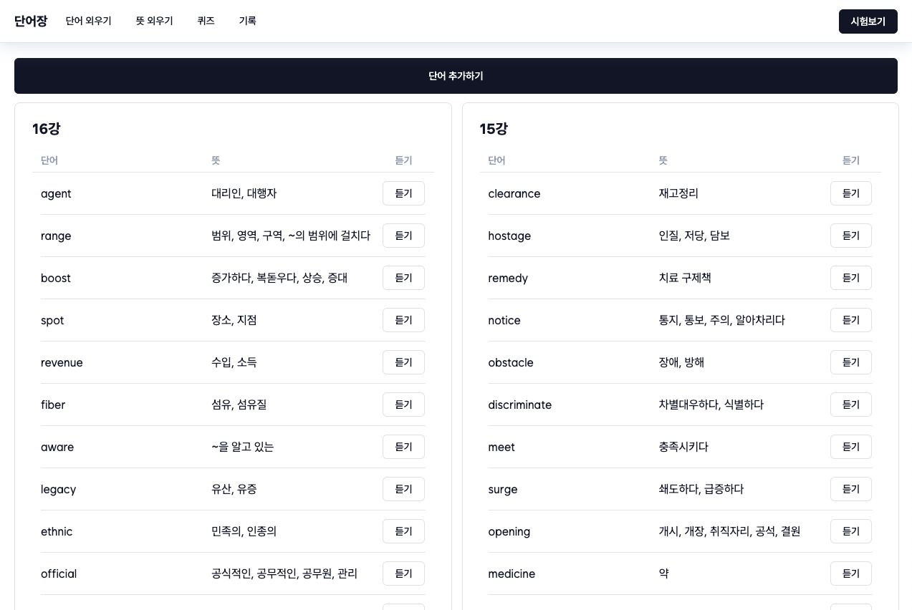

# 단어장

| 프로젝트 진행 기간 | 2024.01.29 - 2024.02.01                          |
| ------------------ | ------------------------------------------------ |
| 프론트엔드         | React.js                                         |
| 백엔드             | Node.js (For DB connection)                      |
| 데이터베이스       | MySQL                                            |
| 배포               | 프론트엔드(vercel) + 백엔드(koyeb) + DB(AWS RDB) |

# 🔨 설치 및 설정

## 📁 공통

### 1. 깃허브 리퍼지토리 클론

```
$ git clone https://github.com/qqaazz0222/React-Node-WordBook.git
```

## 💼 데이터베이스

-   아래 링크를 참고하여 생성 및 배포

<aside>
🔗 [AWS RDB](https://aws.amazon.com/ko/rds/)
[AWS RDB MySQL 생성](https://docs.aws.amazon.com/ko_kr/AmazonRDS/latest/UserGuide/CHAP_Tutorials.WebServerDB.CreateDBInstance.html)

</aside>

## 🎛️ 벡엔드

### 1. 프론트엔드 디렉토리 접속

```
$ cd wordbook-node
```

### 2. 라이브러리 설치

```
$ npm i or install
```

### 3. 환경변수 설정

-   wordbook-react 디렉토리 내 .env_template 파일 참조

```
DB_HOST="input-your-database-address" //AWS RDB 주소 입력
DB_PORT="input-your-database-port" //AWS RDB 포트 입력(기본 3306)
DB_USER="input-your-database-user" //AWS RDB 사용자 입력
DB_PASSWORD="input-your-database-password" //AWS RDB 비밀번호 입력
DB_DATABASE="input-your-database-table-name" //AWS RDB 테이블명 입력
```

### 4. 배포

-   Koyeb을 통해 Node 프로젝트 무료 배포

<aside>
🔗 [Koyeb](https://www.koyeb.com/)
[Koyeb으로 Node.js(express) 배포하기](https://sorious77.tistory.com/197)

</aside>

## 🖥️ 프론트엔드

### 1. 프론트엔드 디렉토리 접속

```
$ cd wordbook-react
```

### 2. 라이브러리 설치

```
$ npm i or install
```

### 3. 환경변수 설정

-   wordbook-react 디렉토리 내 .env_template 파일 참조

```
REACT_APP_DEV_API = "http://127.0.0.1:3001" //필요시 수정
REACT_APP_DEV_API_END_POINT = "http://127.0.0.1:3001/" //필요시 수정
REACT_APP_API = "input-your-node-server-address" //벡엔드 주소 설정
REACT_APP_API_END_POINT = "input-your-node-server-endpoint-include-/"
//'/'를 포함한 엔드포인트 주소 설정
```

### 4. 배포

-   Vercel을 통해 React 프로젝트 무료 배포

<aside>
🔗 [Vercel](https://vercel.com/)
[Vercel로 React 배포하기](https://tobegood.tistory.com/entry/Vercel%EB%A1%9C-%EB%B0%B0%ED%8F%AC%ED%95%98%EA%B8%B0-feat-react)

</aside>

# 📖 페이지 및 기능

<aside>
💡 모든 페이지는 반응형으로 제공합니다. (PC/모바일 환경에 따라 헤더부분 레이아웃 전환)

</aside>

## 단어장 페이지

| 페이지 명   | 단어장, Main                               |
| ----------- | ------------------------------------------ |
| 세부 주소   | /                                          |
| 페이지 설명 | 등록된 전체 강의 및 단어를 표시하는 페이지 |
| 기능        | - 단어 추가하기                            |

-   등록된 단어 조회
-   단어 발음 듣기 |



## 단어 외우기 페이지

| 페이지 명   | 단어 외우기, Word                              |
| ----------- | ---------------------------------------------- |
| 세부 주소   | /word                                          |
| 페이지 설명 | 표시되는 뜻을 통해 단어 암기를 도와주는 페이지 |
| 기능        | - 강의 선택                                    |

-   강의에 포함된 단어 조회
-   보기/숨기기 버튼을 통한 단어 보기/숨기기 |


## 뜻 외우기 페이지

| 페이지 명   | 뜻 외우기, Meaning                             |
| ----------- | ---------------------------------------------- |
| 세부 주소   | /meaning                                       |
| 페이지 설명 | 표시되는 단어을 통해 뜻 암기를 도와주는 페이지 |
| 기능        | - 강의 선택                                    |

-   강의에 포함된 단어 조회
-   단어 발음 듣기
-   보기/숨기기 버튼을 통한 뜻 보기/숨기기 |


## 퀴즈 페이지

| 페이지 명   | 퀴즈, Quiz                              |
| ----------- | --------------------------------------- |
| 세부 주소   | /quiz                                   |
| 페이지 설명 | 퀴즈를 통해 단어 암기를 도와주는 페이지 |
| 기능        | 퀴즈 설정 화면                          |

-   강의 선택
-   퀴즈 타입 및 범위 설정
    퀴즈 진행 화면
-   퀴즈 단어 및 뜻 조회
-   선택지 제공
-   오답 알림
-   (정답 선택시, 발음 듣기 기능) |

### 퀴즈 설정 화면

-   퀴즈 타입 : 단어 또는 뜻으로 퀴즈 응시 가능(중복 선택 가능)
-   퀴즈 범위 : 단어 등록 강의 선택 가능(중복 선택 가능)


### 퀴즈 진행 화면

-   문제 및 선택지 표시


## 시험 페이지

| 페이지 명   | 시험, Exam                           |
| ----------- | ------------------------------------ |
| 세부 주소   | /exam                                |
| 페이지 설명 | 단어 암기를 시험으로 확인하는 페이지 |
| 기능        | 시험 설정 화면                       |

-   강의 선택
    시험 진행 화면
-   퀴즈 단어 및 뜻 표시
-   사용자 정답 입력 |

### 시험 설정 화면

-   퀴즈 타입 : 단어 또는 뜻으로 퀴즈 응시 가능(중복 선택 가능)
-   퀴즈 범위 : 단어 등록 강의 선택 가능(중복 선택 가능)


### 시험 진행 화면


## 시험 페이지

| 페이지 명   | 시험 결과, ExamResult              |
| ----------- | ---------------------------------- |
| 세부 주소   | /exam/result                       |
| 페이지 설명 | 응시한 시험 결과를 확인하는 페이지 |
| 기능        | - 시험 결과 목록 조회              |

-   시험 결과 상세 조회
-   정/오답 조회 |


# 🛠️ API

## 단어 관련 API

## 단어 생성(단일)

| API 주소    | /word/create/one |
| ----------- | ---------------- |
| HTTP 메소드 | POST             |
| 입력값      | lectureId : Int  |

word : String
mean : String |
| 출력값 | 성공 : { status: 200, msg: "추가 성공" }
실패 : { status: 400, msg: "추가 실패" } |

## 단어 생성(다중)

| API 주소    | /word/create/many |
| ----------- | ----------------- |
| HTTP 메소드 | POST              |
| 입력값      | lectureId : Int   |

word : String[]
mean : String[] |
| 출력값 | 성공 : { status: 200, msg: "추가 성공" }
실패 : { status: 400, msg: "추가 실패" } |

## 단어 조회(전체)

| API 주소    | /word/read |
| ----------- | ---------- |
| HTTP 메소드 | GET        |
| 입력값      | -          |
| 출력값      | [          |

    {”wordId”: Int, “lectureId”: Int, “word”: String, “mean”: String, “stared”: 0 or 1},
    …

] |

## 단어 조회(특정 강의)

| API 주소    | /word/read/lecture/lectureId |
| ----------- | ---------------------------- |
| HTTP 메소드 | GET                          |
| 입력값      | -                            |
| 출력값      | [                            |

    {”wordId”: Int, “lectureId”: Int, “word”: String, “mean”: String, “stared”: 0 or 1},
    …

] |

## 단어 수정(단일)

| API 주소    | /word/update/one                  |
| ----------- | --------------------------------- |
| HTTP 메소드 | POST                              |
| 입력값      | key : String //수정할 단어 word값 |

word : String
mean : String |
| 출력값 | 성공 : { status: 200, msg: "수정 성공" }
실패 : { status: 400, msg: "수정 실패" } |

## 단어 삭제(단일)

| API 주소                                 | /word/delete/one                         |
| ---------------------------------------- | ---------------------------------------- |
| HTTP 메소드                              | POST                                     |
| 입력값                                   | word : String                            |
| 출력값                                   | 성공 : { status: 200, msg: "삭제 성공" } |
| 실패 : { status: 400, msg: "삭제 실패" } |

## 단어 삭제(특정 강의)

| API 주소                                 | /word/delete/many                        |
| ---------------------------------------- | ---------------------------------------- |
| HTTP 메소드                              | POST                                     |
| 입력값                                   | lectureId : Int                          |
| 출력값                                   | 성공 : { status: 200, msg: "삭제 성공" } |
| 실패 : { status: 400, msg: "삭제 실패" } |

## 퀴즈 관련 API

## 퀴즈 단어 선택지 조회

| API 주소    | /quiz/read/word                                      |
| ----------- | ---------------------------------------------------- |
| HTTP 메소드 | POST                                                 |
| 입력값      | word : String                                        |
| 출력값      | [{"word": String},{"word": String},{"word": String}] |

## 퀴즈 뜻 선택지 조회

| API 주소    | /quiz/read/mean                                      |
| ----------- | ---------------------------------------------------- |
| HTTP 메소드 | POST                                                 |
| 입력값      | mean : String                                        |
| 출력값      | [{"mean": String},{"mean": String},{"mean": String}] |

## 시험 관련 API

## 시험 결과 생성

| API 주소                                      | /exam/create/result                                           |
| --------------------------------------------- | ------------------------------------------------------------- |
| HTTP 메소드                                   | POST                                                          |
| 입력값                                        | range : Int[]                                                 |
| results : String[]                            |
| 출력값                                        | 성공 : { status: 200, msg: "결고 등록 성공", examId: examId } |
| 실패 : { status: 400, msg: "결고 등록 실패" } |

## 시험 단어 조회(랜덤 순서 조회)

| API 주소    | /exam/read/word     |
| ----------- | ------------------- |
| HTTP 메소드 | POST                |
| 입력값      | lectureList : int[] |
| 출력값      | [                   |

    {”wordId”: Int, “lectureId”: Int, “word”: String, “mean”: String, “stared”: 0 or 1},
    …

] |

## 시험 결과 목록 조회

| API 주소    | /exam/read/results |
| ----------- | ------------------ |
| HTTP 메소드 | GET                |
| 입력값      | -                  |
| 출력값      | -                  |

## 시험 결과 상세 조회

| API 주소    | /exam/read/result/examId |
| ----------- | ------------------------ |
| HTTP 메소드 | GET                      |
| 입력값      | -                        |
| 출력값      | -                        |

## 기타 기능 API

## 등록 단어 정리 기능

-   단어/뜻 등록 시, 불필요하게 입력된 공백 및 줄바꿈 기호 삭제 기능

| API 주소                                                                        | /func/trim               |
| ------------------------------------------------------------------------------- | ------------------------ |
| HTTP 메소드                                                                     | GET                      |
| 입력값                                                                          | -                        |
| 출력값                                                                          | 수정된 단어 없을 때 : [] |
| 수정된 단어 있을 때 : [”[wordId : {wordId}] {originalWord} → {trimmedWord}”, …] |
